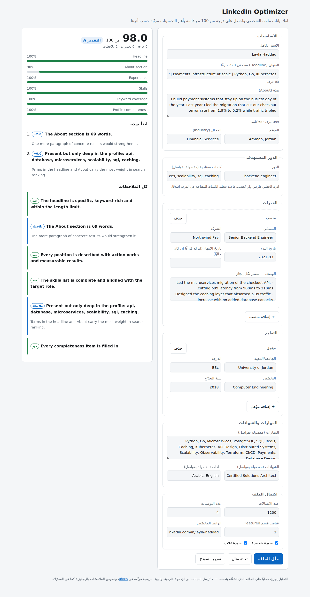

<div dir="rtl">

# linkedin-optimizer

أداة لتحليل ملف LinkedIn الشخصي، تُعطيه درجة من 100 وتُرتّب التحسينات الأهم أولًا.

التحليل كامل **محليًا**: لا يحتاج إلى مفاتيح API ولا اتصال بالإنترنت، والنتيجة ثابتة (deterministic) لنفس المدخلات — أي يمكن تشغيله داخل CI.

## ما الذي يقيسه؟

| القاعدة | الوزن | ما الذي تفحصه |
| --- | --- | --- |
| `headline` | 18 | الطول مقابل حد 220 حرفًا، وجود كلمات مفتاحية، تجنّب «المسمّى الوظيفي فقط»، العبارات الفارغة |
| `about` | 20 | الطول، أول 265 حرفًا (ما يظهر قبل «see more»)، وجود نتائج رقمية، صيغة المتكلّم، دعوة للتواصل |
| `experience` | 22 | وصف لكل منصب، أفعال إنجاز في بداية كل سطر، نتائج قابلة للقياس، التواريخ |
| `skills` | 12 | العدد (٥ كحد أدنى، ١٥+ مُستحسن، ٥٠ حدًا أقصى)، التكرار، مطابقة الدور المستهدف، ترتيب أول ٣ مهارات |
| `keywords` | 16 | تغطية الكلمات المفتاحية للدور المستهدف عبر الملف كله، وتحذير من الحشو |
| `completeness` | 12 | الصورة، الغلاف، الموقع، المجال، الرابط المخصّص، التعليم، الشهادات، اللغات، التوصيات، الاتصالات |

مجموع الأوزان = 100. القاعدة التي لا تنطبق (مثل `keywords` حين لا يُحدَّد دور مستهدف) تُستبعد من الحساب بدل أن تُمنح درجة كاملة.

التقديرات: **A** ≥ 90 · **B** ≥ 80 · **C** ≥ 70 · **D** ≥ 55 · **F** أقل من ذلك.

## التثبيت

<div dir="ltr">

```bash
git clone https://github.com/hajraby24-hue/linkedin-optimizer.git
cd linkedin-optimizer
pip install -e ".[dev]"      # أو: pip install -e .  للنواة فقط بلا اعتماديات
```

</div>

يتطلّب Python 3.10 أو أحدث. نواة الأداة بلا أي اعتماديات خارجية؛ الحزمة الاختيارية `api` تضيف FastAPI و uvicorn فقط.

## الاستيراد من تصدير LinkedIn

بدل تعبئة البيانات يدويًا، نزّل أرشيف حسابك من LinkedIn: **Settings → Data privacy → Get a copy of your data**، ثم:

<div dir="ltr">

```bash
linkedin-optimizer import Basic_LinkedInDataExport.zip -o profile.json
linkedin-optimizer analyze profile.json

# أو حلّل الأرشيف مباشرة دون خطوة وسيطة
linkedin-optimizer analyze Basic_LinkedInDataExport.zip
linkedin-optimizer analyze ./extracted-export/        # مجلّد CSV مفكوك
```

</div>

يقرأ المستورد: `Profile.csv` (الاسم، العنوان، النبذة، الموقع، المجال)، `Positions.csv`، `Education.csv`، `Skills.csv`، `Certifications.csv`، `Languages.csv`، `Connections.csv` (العدد)، و`Recommendations_Received.csv` (المرئية منها فقط). كل ملف اختياري، والمطابقة غير حسّاسة لحالة الأحرف، والأعمدة غير المعروفة تُتجاهل بدل أن تُفشل القراءة.

**ما لا يوجد في التصدير:** الصورة الشخصية، الغلاف، قسم Featured، الرابط المخصّص، والدور المستهدف. لا يخمّنها المستورد بل يتركها فارغة ويطبع ملاحظة بذلك — حتى لا تُنفَخ الدرجة بافتراض. اضبطها بنفسك بعد الاستيراد.

يمكن أيضًا رفع الأرشيف مباشرة من واجهة الويب (حقل «استيراد من LinkedIn» أعلى النموذج) أو عبر `POST /import`.

## الاستخدام من سطر الأوامر

<div dir="ltr">

```bash
# 1) أنشئ ملف بيانات فارغًا واملأه
linkedin-optimizer init profile.json

# 2) حلّله
linkedin-optimizer analyze profile.json

# صيغ إخراج أخرى
linkedin-optimizer analyze profile.json --format json
linkedin-optimizer analyze profile.json --format markdown -o report.md
linkedin-optimizer analyze profile.json --format pdf -o report.pdf

# تجاوز الدور المستهدف من سطر الأوامر
linkedin-optimizer analyze profile.json --target-role "data scientist"
linkedin-optimizer analyze profile.json --target-keyword sql --target-keyword airflow

# للاستخدام داخل CI: يخرج بحالة 1 إذا قلّت الدرجة عن الحد
linkedin-optimizer analyze profile.json --fail-under 70

# القراءة من stdin
cat profile.json | linkedin-optimizer analyze -

# عرض القواعد وأوزانها
linkedin-optimizer rules
```

</div>

رموز الخروج: `0` نجاح · `1` الدرجة أقل من `--fail-under` · `2` مدخلات غير صالحة.

## الاستخدام كمكتبة

<div dir="ltr">

```python
from linkedin_optimizer import Profile, analyze, render_markdown

profile = Profile.from_file("profile.json")
report = analyze(profile, max_actions=5)

print(report.score, report.grade)          # 16.4 F
for action in report.actions:              # مرتّبة حسب أثرها على الدرجة
    print(f"+{action.impact:.1f} pts — {action.message}")

open("report.md", "w").write(render_markdown(report))
```

</div>

## تصدير التقرير PDF

<div dir="ltr">

```bash
pip install -e ".[pdf]"
linkedin-optimizer analyze profile.json --format pdf -o report.pdf
```

</div>

صفحة مرتّبة للطباعة أو للإرفاق مع السيرة الذاتية: الدرجة كرقم رئيسي، ثم مقياس لكل قسم (اللون يحمل الشدّة والنسبة مكتوبة بجانبه دائمًا، فلا تعتمد القراءة على اللون وحده)، ثم الإجراءات المرتّبة وكل الملاحظات.

- من واجهة الويب: زر **«تحميل التقرير PDF»** أسفل النموذج.
- من واجهة البرمجة: `POST /report.pdf` بنفس جسم `/analyze`، ويُرجع الملف كمرفق.
- `--format pdf` يتطلّب `-o` لأن المخرَج ثنائي؛ و`--fail-under` يظل ساريًا.

الحزمة الاختيارية `pdf` تضيف ReportLab مع `arabic-reshaper` و`python-bidi` حتى تُرسم الأسماء العربية موصولة وبالاتجاه الصحيح. تُستخدم أول خطّ Unicode متاح على النظام (DejaVu أو Noto أو Liberation)، وإلا يعود إلى Helvetica — وهو لا يدعم الحروف العربية، فإن كان اسمك بالعربية ثبّت أحد هذه الخطوط.

بدون تثبيت الحزمة الاختيارية تعمل بقية الأداة كما هي، ويظهر خطأ واضح يذكر أمر التثبيت.

## واجهة الويب

<div dir="ltr">

```bash
pip install -e ".[api]"
uvicorn linkedin_optimizer.api:app --reload
# ثم افتح http://127.0.0.1:8000
```

</div>

نموذج بسيط تملؤه وتضغط «حلّل الملف» فتظهر الدرجة والأقسام والملاحظات مباشرةً. لا يوجد أي build step ولا اعتماديات خارجية: ثلاثة ملفات ثابتة فقط (`index.html`, `styles.css`, `app.js`) تُشحن داخل الحزمة، ولا تُحمَّل أي مكتبة من CDN — فالأداة تعمل بلا إنترنت.



مزايا النموذج: إضافة/حذف المناصب والمؤهلات ديناميكيًا، عدّاد أحرف للعنوان (ينبّه عند تجاوز 220) وعدّاد كلمات للنبذة، زر «تعبئة مثال»، وتقرير ملوّن حسب شدّة الملاحظة مع دعم الوضع الداكن تلقائيًا.

الواجهة بالعربية (RTL)، أما نصوص الملاحظات فتأتي بالإنجليزية كما يُخرجها المحرّك.

## واجهة HTTP

<div dir="ltr">

| المسار | الطريقة | الوصف |
| --- | --- | --- |
| `/` | GET | واجهة الويب |
| `/import` | POST | رفع أرشيف التصدير (multipart) وإرجاع بيانات الملف |
| `/report.pdf` | POST | تحليل ملف شخصي وإرجاع التقرير كملف PDF |
| `/health` | GET | حالة الخدمة ورقم الإصدار |
| `/rules` | GET | قائمة القواعد وأوزانها |
| `/analyze` | POST | تحليل ملف شخصي وإرجاع التقرير |
| `/docs` | GET | توثيق OpenAPI تفاعلي |

```bash
curl -s localhost:8000/analyze \
  -H 'content-type: application/json' \
  -d '{"profile": {"headline": "Software Engineer at Acme", "target_role": "data scientist"}}' | jq .score
```

</div>

## صيغة ملف البيانات

كل الحقول اختيارية؛ الحقل الناقص يُحسب كأنه غير موجود. أمثلة جاهزة في `examples/`:
`strong_profile.json` (98/100) و `weak_profile.json` (16/100).

<div dir="ltr">

```json
{
  "full_name": "Layla Haddad",
  "headline": "Senior Backend Engineer | Payments at scale | Python, Go",
  "about": "...",
  "location": "Amman, Jordan",
  "industry": "Financial Services",
  "target_role": "backend engineer",
  "target_keywords": ["api", "caching", "microservices"],
  "experiences": [
    {
      "title": "Senior Backend Engineer",
      "company": "Northwind Pay",
      "start_date": "2021-03",
      "end_date": "",
      "description": "- Led the migration that cut p99 latency from 900ms to 210ms."
    }
  ],
  "educations": [{ "school": "University of Jordan", "degree": "BSc", "field_of_study": "Computer Engineering" }],
  "skills": ["Python", "Go", "Microservices"],
  "certifications": ["AWS Certified Solutions Architect"],
  "languages": ["Arabic", "English"],
  "featured_count": 2,
  "recommendations_count": 4,
  "connections_count": 1200,
  "has_photo": true,
  "has_banner": true,
  "custom_url": "linkedin.com/in/layla-haddad"
}
```

</div>

> `end_date` فارغ يعني «حتى الآن». البيانات تُملأ يدويًا أو تُصدَّر من LinkedIn؛ الأداة لا تجمع بيانات من الموقع ولا تتجاوز شروط استخدامه.

## بنية المشروع

<div dir="ltr">

```
src/linkedin_optimizer/
├── models.py       # Profile / Experience / Education + التحقق من المدخلات
├── linkedin_export.py  # قراءة أرشيف التصدير (ZIP أو مجلّد CSV)
├── text.py         # أدوات نصية: الترميز، الأفعال، الأرقام، الكلمات المفتاحية للأدوار
├── rules/          # كل قاعدة في ملف مستقل، ترث من Rule
│   ├── base.py     # Rule / RuleResult / Finding
│   ├── headline.py  about.py  experience.py  skills.py  keywords.py  completeness.py
├── engine.py       # تشغيل القواعد، الدرجة النهائية، ترتيب الإجراءات
├── report.py       # عرض النتيجة: نص ملوّن / JSON / Markdown
├── pdf.py          # تصدير التقرير PDF (اختياري: ReportLab)
├── cli.py          # واجهة سطر الأوامر
├── api.py          # واجهة FastAPI + تقديم صفحة الويب
└── static/         # واجهة الويب: index.html, styles.css, app.js, favicon.svg
```

</div>

## إضافة قاعدة جديدة

<div dir="ltr">

```python
from linkedin_optimizer.rules.base import Rule, RuleResult
from linkedin_optimizer.models import Profile

class VolunteeringRule(Rule):
    id = "volunteering"
    category = "volunteering"
    title = "Volunteering"
    weight = 5.0

    def evaluate(self, profile: Profile) -> RuleResult:
        ...  # أرجِع self._result(score, findings)
```

</div>

ثم أضِفها إلى `DEFAULT_RULES` في `src/linkedin_optimizer/rules/__init__.py` مع تعديل الأوزان ليبقى مجموعها 100 (يوجد اختبار يتحقق من ذلك).

## التطوير

<div dir="ltr">

```bash
pytest          # 193 اختبارًا
ruff check .
```

</div>

## الرخصة

MIT — انظر ملف [LICENSE](LICENSE).

</div>
